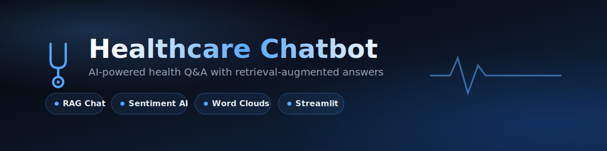

<div align="center">



[](https://www.python.org/)
[](https://streamlit.io/)
[](https://openrouter.ai/)
[](LICENSE)

[**🔗 Live Demo**](#) · [**🐛 Report Bug**](https://github.com/Mustafaali04/healthcare-chatbot/issues) · [**💡 Request Feature**](https://github.com/Mustafaali04/healthcare-chatbot/issues)

</div>

---

## 📖 About

A conversational AI chatbot that answers health-related questions using **Retrieval-Augmented Generation (RAG)**, paired with a **patient sentiment analysis dashboard**. Built as an independent project inspired by [Omdena's healthcare chatbot initiative](https://www.omdena.com/blog/healthcare-chatbot).

<div align="center">
<i>Ask about symptoms, treatment, or prevention — get grounded answers backed by a curated knowledge base, with smart fallback to general medical knowledge when needed.</i>
</div>

---

## 📑 Table of Contents

- [Features](#-features)
- [Tech Stack](#%EF%B8%8F-tech-stack)
- [Project Structure](#-project-structure)
- [Getting Started](#-getting-started)
- [How It Works](#-how-it-works-rag-pipeline)
- [Sentiment Analysis](#-sentiment-analysis)
- [Roadmap](#-roadmap)
- [Acknowledgements](#-acknowledgements)

---

## ✨ Features

| | |
|---|---|
| 🤖 **RAG-based chatbot** | Retrieves relevant info from a curated knowledge base (10 diseases) and generates grounded answers |
| 🔄 **Smart fallback** | Falls back to general medical knowledge when a topic isn't in the dataset — clearly labeled |
| 📊 **Sentiment analysis** | Classifies patient reviews as Positive / Negative / Neutral using VADER |
| ☁️ **Word clouds** | Visualizes the most common terms in positive vs. negative reviews |
| 🔐 **Session login** | Simple personalized session for each user |
| 🎨 **Custom UI** | Dark, gradient-themed interface built with Streamlit |

---

## 🛠️ Tech Stack

<div align="center">

| Layer | Tool |
|:---|:---|
| **UI / Frontend** | Streamlit |
| **LLM** | OpenRouter API (free-tier models) |
| **Retrieval** | Pandas (keyword-based search) |
| **Sentiment Analysis** | VADER (`vaderSentiment`) |
| **Visualization** | Matplotlib · WordCloud · Streamlit charts |
| **Data** | CSV knowledge base |
| **Secrets** | `python-dotenv` |

</div>

---

## 📁 Project Structure

```
healthcare-chatbot/
├── assets/
│   └── banner.png            # README banner
├── app/
│   └── streamlit_app.py      # Main Streamlit UI (chatbot + dashboard tabs)
├── data/
│   ├── diseases.csv          # Knowledge base: 10 diseases × symptoms/treatment/prevention
│   └── reviews.csv           # Sample patient reviews for sentiment analysis
├── chatbot.py                 # RAG logic: retrieval + LLM prompting
├── load_data.py                # Data loading and keyword search
├── sentiment.py                # VADER sentiment analysis + word cloud generation
├── requirements.txt
└── .env                        # API key (not committed)
```

---

## 🚀 Getting Started

### Prerequisites
- Python 3.10+
- A free [OpenRouter](https://openrouter.ai/keys) API key

### Installation

```bash
# 1. Clone the repo
git clone https://github.com/Mustafaali04/healthcare-chatbot.git
cd healthcare-chatbot

# 2. Create a virtual environment
python -m venv venv
venv\Scripts\activate      # Windows
source venv/bin/activate   # Mac/Linux

# 3. Install dependencies
pip install -r requirements.txt
```

### Configuration

Create a `.env` file in the project root:
```env
OPENROUTER_API_KEY=your_key_here
```

### Run

```bash
streamlit run app/streamlit_app.py
```

---

## 🧠 How It Works (RAG Pipeline)

```
User Question
      │
      ▼
Search knowledge base (diseases.csv)
      │
      ├── Match found ──► Pass as context to LLM ──► Grounded answer
      │
      └── No match ──► Ask LLM using general knowledge ──► Labeled fallback answer
```

Includes automatic retry logic to smooth over occasional unreliable responses from free-tier LLM models.

---

## 📊 Sentiment Analysis

Sample patient reviews are analyzed using **VADER**, a lexicon-based sentiment tool well-suited for short, informal text.

**Visualized through:**
- 📈 Sentiment count metrics (Positive / Negative / Neutral)
- 📊 Bar chart breakdown
- ☁️ Word clouds for positive vs. negative reviews

---

## 🔮 Roadmap

- [ ] Replace keyword search with vector embeddings for semantic retrieval
- [ ] Expand knowledge base with real web-scraped medical data
- [ ] Use real patient review data instead of sample text
- [ ] Add proper authentication
- [ ] Add source citations to answers

---

## 🙏 Acknowledgements

Inspired by [Omdena's Healthcare Chatbot project](https://www.omdena.com/blog/healthcare-chatbot), which combined a chatbot, sentiment analysis, and data dashboards using Rasa and real Twitter data at team scale. This project reimplements the same core ideas independently, using a modern RAG-based approach with an LLM instead of a rule-based conversational framework.

---

<div align="center">

Made with 🩺 by [Mustafaali04](https://github.com/Mustafaali04)

</div>
